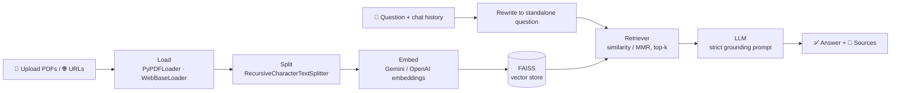

# 📚 AskMyDocs — Chat With Your PDFs & URLs

**Upload PDFs or paste web links, then ask questions in plain English. Every answer comes only from your documents, with file + page citations you can check.**


🔗 **Live demo:** [askmydocs.streamlit.app](https://YOUR-APP-NAME.streamlit.app) _(replace with your deployed URL)_

---

## ✨ Features

### ✨ Studio: turn documents into useful outputs
- **📝 Summary**: TL;DR, key points and "why it matters", in three lengths
- **🔍 Insights**: key numbers, people and organizations, dates, action items and risks
- **🧠 Quiz**: scored multiple-choice quiz with explanations (easy / medium / hard)
- **🃏 Flashcards**: flip-card study deck with shuffle and progress
- **🗺️ Mind map**: visual Graphviz map of the main topics
- **❓ FAQ**: questions a reader would ask, answered from the documents
- **⚖️ Compare**: side-by-side table of two or more documents
- **✍️ Writer**: emails, executive reports, LinkedIn posts, meeting notes, proposals and more, with tone control
- Every Studio result can be downloaded as Markdown, or bundled with the chat in one **workspace report**

### 💬 Chat
- **5 answer styles** (Concise, Detailed, Bullet points, Simple/ELI5, Executive) and **10 answer languages**
- 👍 / 👎 feedback on every answer
- **📊 Library dashboard** with per-document pages, words, reading time and top keywords
- **✨ One-click sample**: visitors can try every feature on a bundled sample contract and quarterly report, with no upload and no outbound requests

### 🎨 Design
- **Design system generated with [UI/UX Pro Max](https://github.com/nextlevelbuilder/ui-ux-pro-max-skill)**: flat style, teal + orange palette, Plus Jakarta Sans, SVG icons only. Tokens and rules live in [`design-system/askmydocs/MASTER.md`](design-system/askmydocs/MASTER.md)
- **React + Framer Motion custom Streamlit component** for the animated landing page (live product demo, staggered reveals), count-up stats and 3D flip flashcards with swipe and keyboard support
- Honors `prefers-reduced-motion`; WCAG AA contrast on primary actions

### 🧱 Core

- **Multi-PDF upload** (20 MB per file, enforced with a friendly error) and **URL ingestion** (one per line)
- **Grounded answers with citations**: every fact is cited inline like `(report.pdf, p. 4)`, plus a **Sources** panel with a preview of each chunk
- **Honest "I don't know"**: if the answer isn't in your documents, it replies *"I couldn't find that in your documents."*
- **Conversational memory**: follow-ups like *"explain the second point more"* are rewritten into standalone questions before retrieval
- **Token-by-token streaming** answers
- **Two providers**: Google Gemini (default, free tier) or OpenAI, switchable in the sidebar
- **Tunable retrieval**: chunk size/overlap, top-k, similarity or MMR search
- **Smart caching**: files are SHA-256 hashed, so re-uploading the same file never re-embeds it
- **Suggested questions** generated from your documents after processing
- **Export chat** to Markdown, including sources
- **Persistent index**: the FAISS index is saved to `vectorstore/` and reloaded on restart
- **Friendly errors** for scanned/empty PDFs, broken URLs and wrong API keys (no stack traces)

## 🏗️ Architecture



The RAG pipeline is written in **plain LCEL** (`langchain-core` runnables), with no legacy chain classes:
`RunnablePassthrough.assign(context=history_aware_retriever).assign(answer=prompt | llm | StrOutputParser())`.

## 🧰 Tech Stack

| Layer | Choice |
|---|---|
| Language | Python 3.11 |
| UI | Streamlit (`st.chat_message`, `st.chat_input`, `st.write_stream`) |
| RAG framework | LangChain LCEL (`langchain-core`, `langchain-community`, `langchain-text-splitters`) |
| LLMs | Google Gemini (`langchain-google-genai`), OpenAI (`langchain-openai`) |
| Embeddings | `gemini-embedding-001` / `text-embedding-3-small` |
| Vector store | FAISS (CPU, local) |
| Loaders | `pypdf` via `PyPDFLoader`, `WebBaseLoader` + BeautifulSoup |
| Config | `pydantic-settings` + `.env` |
| Testing | `pytest` with fake LLM + fake embeddings (no API key needed) |
| Packaging | `requirements.txt`, `Dockerfile` |

## 🚀 Quick Start

```bash
git clone https://github.com/aghakazimali-ML/askmydocs.git
cd askmydocs

python -m venv .venv
source .venv/bin/activate          # Windows: .venv\Scripts\activate

pip install -r requirements.txt
cp .env.example .env               # Windows: copy .env.example .env
# open .env and paste your GOOGLE_API_KEY (free at https://aistudio.google.com/app/apikey)

streamlit run app.py
```

Open http://localhost:8501. You can also paste the API key directly in the sidebar instead of using `.env`.

## 🐳 Run with Docker

```bash
docker build -t askmydocs .
docker run --rm -p 8501:8501 --env-file .env askmydocs
```

To keep the saved index between container runs, mount a volume:

```bash
docker run --rm -p 8501:8501 --env-file .env -v "$(pwd)/vectorstore:/app/vectorstore" askmydocs
```

## ☁️ Deploy to Streamlit Community Cloud (free)

1. Push this project to a **public GitHub repository** (`.env` is git-ignored, so your key stays private).
2. Go to [share.streamlit.io](https://share.streamlit.io) and sign in with GitHub.
3. Click **Create app** → **Deploy a public app from GitHub**.
4. Select your repository, branch `main`, and main file path `app.py`.
5. Open **Advanced settings**, choose **Python 3.11**, and in **Secrets** paste:
   ```toml
   GOOGLE_API_KEY = "your-gemini-key"
   # OPENAI_API_KEY = "sk-..."   # optional
   ```
6. Click **Deploy**. After a minute or two your app is live at `https://<your-app>.streamlit.app`.
7. Put that URL in the **Live demo** link above.

> Note: Community Cloud storage is temporary, so the saved `vectorstore/` lasts until the app restarts.

## ⚙️ Configuration

All settings can be set as environment variables or in `.env`. Sidebar values override them at runtime.

| Variable | Default | Description |
|---|---|---|
| `GOOGLE_API_KEY` | _(empty)_ | Gemini API key |
| `OPENAI_API_KEY` | _(empty)_ | OpenAI API key |
| `DEFAULT_PROVIDER` | `gemini` | `gemini` or `openai` |
| `GEMINI_CHAT_MODEL` | `gemini-3.5-flash` | Default Gemini chat model |
| `GEMINI_EMBEDDING_MODEL` | `gemini-embedding-001` | Gemini embedding model |
| `OPENAI_CHAT_MODEL` | `gpt-4.1-mini` | Default OpenAI chat model |
| `OPENAI_EMBEDDING_MODEL` | `text-embedding-3-small` | OpenAI embedding model |
| `TEMPERATURE` | `0.1` | Sampling temperature (0–1) |
| `CHUNK_SIZE` | `1000` | Characters per chunk |
| `CHUNK_OVERLAP` | `150` | Characters shared between neighbouring chunks |
| `TOP_K` | `4` | Chunks retrieved per question |
| `SEARCH_TYPE` | `similarity` | `similarity` or `mmr` |
| `MAX_FILE_SIZE_MB` | `20` | Upload limit per PDF |
| `URL_TIMEOUT_SECONDS` | `15` | Timeout when fetching web pages |
| `MAX_HISTORY_TURNS` | `6` | Past Q&A turns used to rewrite follow-ups |
| `VECTORSTORE_DIR` | `vectorstore` | Where the FAISS index is saved |
| `LOG_LEVEL` | `INFO` | Python logging level |

## 🎞️ Rebuilding the animated components

The compiled bundle in `src/motion/dist` is committed, so running or deploying the app needs no Node.js. Only rebuild after editing `frontend/src`:

```bash
cd frontend
npm install
npm run build   # writes to ../src/motion/dist
```

## 🧪 Running Tests

```bash
pytest
```

The tests use `FakeListChatModel` and `FakeEmbeddings`, and build tiny PDFs in pure Python, so **no API key or internet connection is needed**. They cover PDF loading (1-based pages, size/empty/scanned errors), chunking (size, overlap, metadata), the RAG chain (answers, sources, follow-ups, streaming), index save/load, suggestions and export.

## 📁 Project Structure

```
askmydocs/
├── app.py                     # Streamlit entry point (UI wiring only)
├── src/
│   ├── config.py              # pydantic-settings: defaults + env vars
│   ├── loaders.py             # PDF + URL loading, validation, metadata
│   ├── splitter.py            # chunking + chunk_id metadata
│   ├── vectorstore.py         # FAISS build/save/load, SHA-256 hashing
│   ├── llm.py                 # Gemini/OpenAI chat + embeddings factory, error messages
│   ├── chain.py               # history-aware RAG chain (LCEL), streaming
│   ├── prompts.py             # all prompt templates
│   ├── suggestions.py         # suggested-question generation
│   ├── export.py              # chat → Markdown
│   ├── studio.py              # Studio tools (summary, quiz, flashcards, mind map…) + library stats
│   ├── studio_ui.py           # Studio and Library tab rendering
│   ├── motion/                # Streamlit custom component wrapper + compiled React bundle (dist/)
│   └── ui_components.py       # theme CSS, hero, sidebar, landing page, source cards
├── frontend/                  # React + Framer Motion source for src/motion (Vite)
├── design-system/             # UI/UX Pro Max design system (MASTER.md)
├── docs/samples/              # bundled sample documents for the one-click demo
├── tests/                     # pytest suite (offline)
│   ├── conftest.py            # builds sample PDFs in pure Python
│   ├── test_loaders.py
│   ├── test_splitter.py
│   ├── test_chain.py
│   ├── test_studio.py
│   └── fixtures/sample.pdf
├── .streamlit/config.toml     # theme
├── .env.example
├── requirements.txt
├── Dockerfile
├── LICENSE
└── README.md
```

## ⚠️ Limitations & Future Improvements

- **Scanned PDFs**: image-only PDFs have no text layer; add OCR (e.g. Tesseract / `unstructured`) to support them.
- **Hybrid search**: combine BM25 keyword search with vector search for exact terms, codes and names.
- **Reranking**: add a cross-encoder reranker (e.g. Cohere Rerank or `bge-reranker`) to improve top-k precision.
- **User auth & multi-tenancy**: per-user indexes and login for team use.
- **JavaScript-heavy sites**: `WebBaseLoader` reads static HTML only; pages that render with JavaScript need a headless browser loader.
- **Provider lock per index**: vectors from one embedding model can't be mixed with another, so switching provider requires **Reset all**.

## 👤 Author

**Agha Kazim Ali, AI Automation & RAG Developer**

- Upwork: [Agha Kazim Ali](https://www.upwork.com/freelancers/~014a0a1deb6b2d912d)
- Website: [Axion.ai](https://axion-ai-nine.vercel.app/)
- GitHub: [aghakazimali-ML](https://github.com/aghakazimali-ML)

Licensed under the [MIT License](LICENSE).
